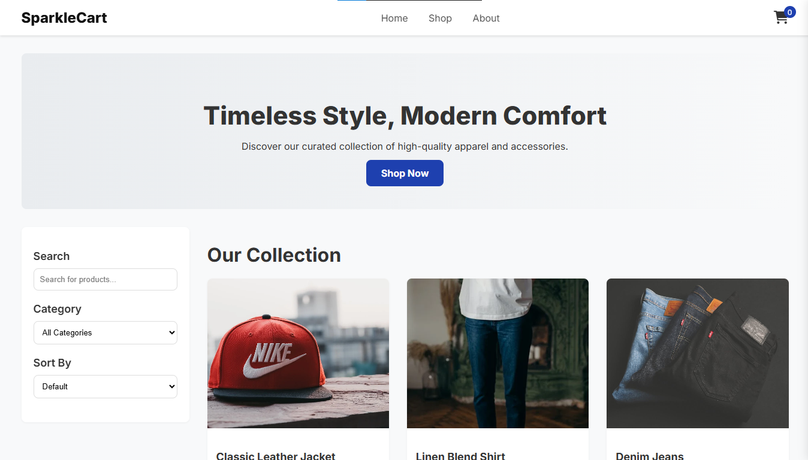
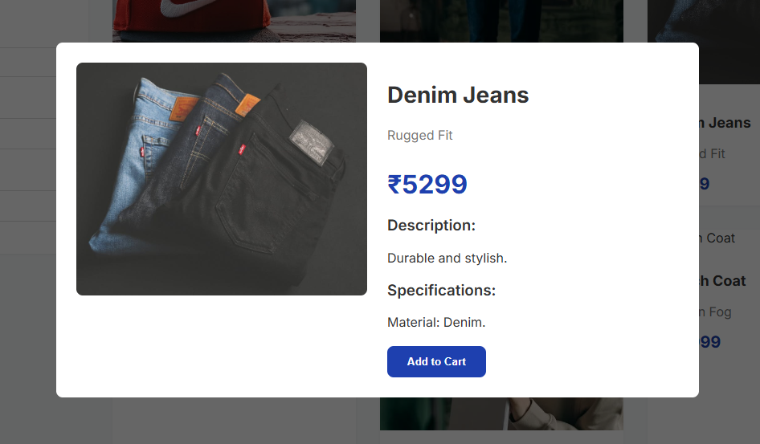

# SparkleCart E-commerce Website 🛒


A complete, single-page e-commerce website built from scratch with vanilla JavaScript, HTML, and CSS. This project simulates a real-world online shopping experience, from browsing and filtering products to a multi-step checkout process.

---

### [**➡️ Live Demo Link**](https://ankush-poonia007.github.io/SparkleCart_Project/)

*(Replace with your actual GitHub Pages link after deploying)*

---

### 📸 Screenshots

Here’s a look at the application's clean and modern interface, which is fully responsive across all devices.

| Main Shop Page                                                                                                              | Product Details Modal                                                                                                        |
| --------------------------------------------------------------------------------------------------------------------------- | ---------------------------------------------------------------------------------------------------------------------------- |
|  |  |
| *The main shop layout with a dedicated filter sidebar and product grid.* | *The detailed product view with a pop-up modal and add-to-cart functionality.* |

---

## 🌟 Key Features

This application fulfills all the requirements of the Algonive internship task and includes many advanced features to create a polished user experience.

* **🛍️ Dynamic Product Catalog:**
    * Features over 30 products across multiple categories.
    * Products are rendered dynamically using JavaScript.

* **🔍 Powerful Filtering & Sorting:**
    * **Live Search:** Instantly filter products by name as you type.
    * **Category Filter:** View products by specific categories (Apparel, Accessories, Footwear).
    * **Sort Options:** Sort the results by price or customer rating.

* **🖼️ Interactive Product Details:**
    * **Image Gallery:** A pop-up modal with a main image and clickable thumbnails.
    * **Product Variants:** Selectable options for color and size that update the UI.
    * **Detailed Information:** Tabbed sections for product descriptions and customer reviews.

* **🛒 Full Shopping Cart & Checkout Flow:**
    * **Add to Cart:** A persistent shopping cart that updates in real-time.
    * **Slide-out Cart Sidebar:** View and manage cart items without leaving the page.
    * **Quantity Management:** Smarter cart logic that updates the quantity if an item is already present.
    * **Multi-Step Checkout:** A realistic, dummy checkout process for shipping and payment.

* **✨ Professional UI/UX:**
    * **Toast Notifications:** Non-intrusive feedback for user actions.
    * **Responsive Design:** A two-column layout on desktops that cleanly stacks on mobile.
    * **Mobile Hamburger Menu:** A fully functional navigation menu for smaller screens.

---

## 🛠️ Tech Stack & Architecture

This project was built from the ground up using fundamental web technologies to demonstrate a strong understanding of core development principles.


* **HTML5:** Structured with semantic tags for accessibility and SEO.
* **CSS3:** Custom styling for a unique and modern design, including Flexbox and Grid.
* **JavaScript (ES6+):**
    * **No Frameworks:** All logic is pure, vanilla JavaScript.
    * **Modular Code:** The JavaScript is professionally organized into separate files (`data.js`, `ui.js`, `main.js`).

---

## 🚀 Getting Started

To get a local copy up and running, follow these simple steps.

1.  **Clone the repository:**
    ```sh
    git clone [https://github.com/your-username/SparkleCart_Project.git](https://github.com/your-username/SparkleCart_Project.git)
    ```

2.  **Navigate to the project directory:**
    ```sh
    cd SparkleCart_Project
    ```

3.  **Run a Live Server:**
    Because this project uses JavaScript modules, it must be run from a server. The easiest way is with the "Live Server" extension in VS Code.
    * Right-click the `index.html` file.
    * Select "Open with Live Server".

---

## 👤 Author

**Ankush Poonia**

* **GitHub:** [@ankush-poonia007](https://github.com/ankush-poonia007)
* **LinkedIn:** [Ankush Poonia](https://www.linkedin.com/in/ankushpoonia007/)
